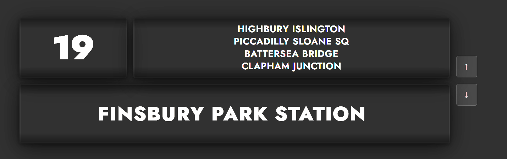

# London Bus Destination Blind




---

## :bulb: About

This is a single-file web app that recreates the destination blind found on London buses.
## :sparkles: Features

- **Classic roller blind**
- **London destinations**
- **Multi-input navigation**
- **Accessible**
- **Responsive**
- **Zero dependencies**


## :wrench: Customising destinations

Edit the `DESTINATIONS` array near the top of the `<script>` block in `index.html`:

```js
{ route: '19', destination: 'Finsbury Park', via: '' },
```

Set `route: ''` for a "NOT IN SERVICE" entry.

---

## :toolbox: Tech stack

| Layer | Technology |
|---|---|
| Markup | HTML5 with semantic ARIA |
| Styling | CSS3 — custom properties, `clamp()`, keyframe animations |
| Logic | Vanilla ES6+ JavaScript |
| Typography | [Jost](https://fonts.google.com/specimen/Jost) (Google Fonts) — closest free substitute for TfL's New Johnston |
| Build | None — static single file |

---

